# PRIMER VISTAZO A LOS DATOS
Antes de hacer un gráfico vemos las dimensiones contenido etc. de forma rápida.

Para los ejemplos usaremos alguna veces datos incluidos en R de la librería datasets y otras veces generaremos series aleatorias rápidas.

Lectura de datsets que contiene tablas y dataframes de datos de ejemplo:
```{r eval=FALSE}
    library(datasets) # cargamos el paquete de datos de muestra
    head(cars)
    dim(cars)   # dimension de la tabla
    names(cars) # para saber los nombres de las variables en la tabla cars
    
    summary(cars$speed) # da el min, 25%,mediana=50%, media, 75% y max
    quantile(cars$speed)
```

## SELECCIONAR SUBCONJUNTOS DE LOS DATOS
Es muy importante saber seleccionar datos de un data frame. Aparte de librerías especificas como dplyr y plyr, la manera más sencilla suele ser usar el propio lenguaje R:
```{r eval=FALSE}
    # Seleccionar una columna por numero
    x[,1]
    # Seleccionar columna por name
    x[,"var1"]
    # Seleccionar parte de una fila y columna a la vez
    x[1:2,"var2"]
    # Seleccionar con operadores lógicos
    # selecciono los valores que cumplen esta condición en todas las columnas
    x[(x$var1<=3 & x$var3 >11),] # AND 
    x[(x$var1<=3 | x$var3>15),] # OR
    # Seleccionar con which
    x[which(x$var2>8),]
    x[(x$var2>8),]  # ver diferencia respecto a NA
    
    # subset  selecciona
    subset(df, df$var1=="west")
    
    # sumaparcial table suma frecuencias
    table(cars$speed)
    # split selecciona y agrupa subconjuntos
    

    df_split<-split(df,list(df$year,df$type))
    
    # aggregate suma parciales
    sumaparcial<-aggregate(Emissions ~ year + type, data=BaltCity, sum)

    # idem con dplyr
    library(dplyr)
     xta <- nei %>%
        filter(fips == 24510) %>%
        group_by(year, type) %>%
        summarize(total.emissions = sum(Emissions))
```

## GENERAR SERIES ALEATORIAS

Para muestra y ejemplos muchas veces necesitamos generar una serie de datos aleatoria rápida. Damos aquí una pequeña muestra de funciones útiles para este fin:

```{r eval=FALSE}
    # genera una serie de numeros del 1 al 12 en orden aleatoro y sin repetir
        sample(1:12) 
    # repite 1,2,3,4,5 ---- 3 veces    
        rep(c(1:5),3)
    # repite cero, 5 veces y tres, 5 veces --> 0 0 0 0 0 3 3 3 3 3
        rep(c(0,3),each=5)
    #Generamos datos aleatorios
        x<-1:100        # serie de numeros de 1 a 100
    # serie de 100 números aleatorios normales de media 0 y sd=5 
        y<-rnorm(100,0,5)   
    # Creamos undata frame
        df<-data.frame(x,y)
```

```{r echo=FALSE}
    library(datasets)
        x<-1:100        # serie de numeros de 1 a 100
    # serie de 100 números aleatorios normales de media 0 y sd=5 
        y<-rnorm(100,0,5)   
    # Creamos undata frame
        df<-data.frame(x,y)
        setwd("C:/R/proyectos/Data_Science_Coursera/04_EXPLORAR_Y_ANALIZAR_DATOS/")
    # Lectura del fichero con los datos EPA  para los ejemplos
        pollution <- read.table("avgpm25.csv", header =TRUE,
            colClasses=c("numeric", "character","factor","numeric","numeric"))
```


# HISTOGRAMAS
 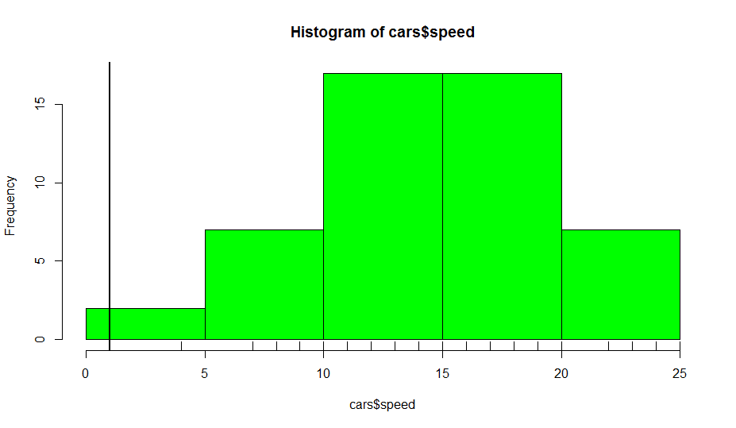
 
```{r fig.cap='Histogramas base system',fig.width=0.7*a4ancho,fig.height=0.25*a4alto}
    # GRAFICAS DE HISTOGRAMAS
        hist(cars$speed, col="green")
    # añadiendo rug para ver marcas de datos
        rug(cars$speed)
    #Otro
        hist(y, col="tomato", breaks=5)
        rug(y)
    # añadimos linea vertical
        abline(v= 1, lwd=2) # grosor 2)
    # añadimos linea vertical en la media
        abline(v= median(y), col= "navy", lwd=4) 
     # lwd=line_width=grosor 2)
     # lty=tipo linea
    
    barplot(table(pollution$region), col="wheat", main="numero de condados por region")
```

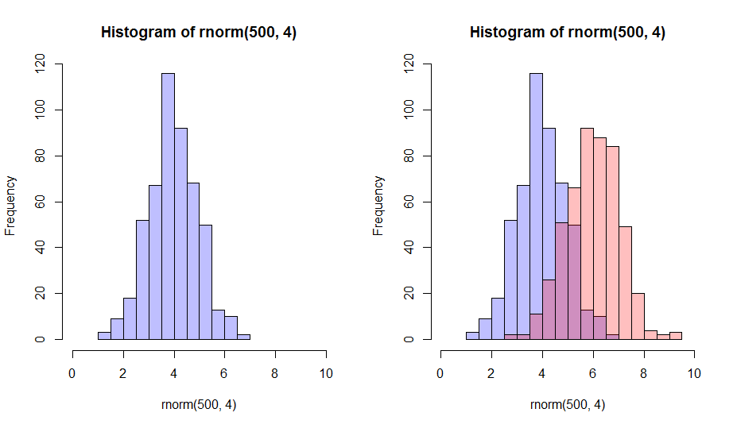
```{r fig.cap='Histogramas',fig.width=0.7*a4ancho,fig.height=0.2*a4alto}
    set.seed(42)
    par(mfrow=c(1,2))                            # una fila con dos col de graficos
    p1 <- hist(rnorm(500,4))                     # centrado en 4
    p2 <- hist(rnorm(500,6))                     # centrado en 6
    plot( p1, col=rgb(0,0,1,1/4), xlim=c(0,10))  # primer histograma
    
    plot( p1, col=rgb(0,0,1,1/4), xlim=c(0,10))  # repetimos para la segunda grafica
    plot( p2, col=rgb(1,0,0,1/4), xlim=c(0,10), add=T) # ojo con add añadimos al mismo grafico
    dev.off()

```
### Ejemplo de histograma

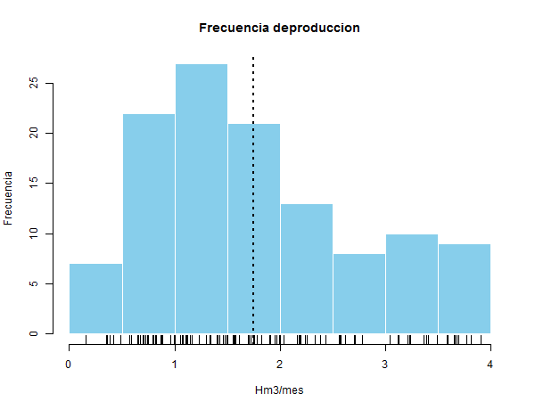

```{r}
   png('hist_1.png',width = 600, height = 460, units = "px")
    # Histograma de producciones mensuales
    #par(family="Arial Narrow")
    hist(dtVal$produccion, col="skyblue",border = FALSE,
         main = "Frecuencia deproduccion",
         xlab="Hm3/mes", ylab="Frecuencia")
    # añadimos la media mensual de produccion
    abline(v=mean(dtVal$produccion),lty=3, lwd=2)
    rug(dtVal$produccion)
    dev.off()
    png('boxplot1.png',width = 600, height = 460, units = "px")
    # grafica de boxplot de produccion mensual
    micolor=rainbow(12,v=0.5,alpha = 0.5)
    boxplot(produccion ~ mes,dtVal,main="Produccion mensual",
        xlab="Mes", ylab=expression('Producción en Hm'^3), col=micolor)
    dev.off()
```

## Histograma con ggplot2
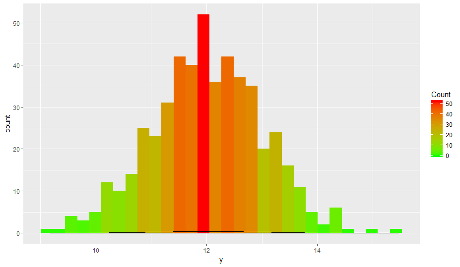
```{r fig.cap='Histogramas ggplot',fig.width=0.7*a4ancho,fig.height=0.25*a4alto}
    library(ggplot2)
    
    df<-data.frame(x=rnorm(500,4),y=rnorm(500,12))

     ggplot(df, aes(y)) +
      geom_histogram(aes(fill=..count..)) +
      scale_fill_gradient("Count", low = "green", high = "red")+
      geom_density(position = "stack")
```

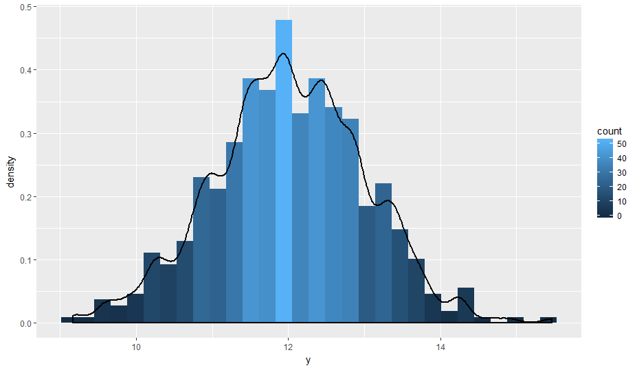
```{r}
    # funcion de densidad
    ggplot(df, aes(x=y)) +
      geom_histogram(aes(y =..density.., fill=..count..)) +
      geom_density(lwd=1,adjust = 1/2) 
```


# BOX WHISPER
Para los graficos de cajas es necesario si queremos hacr categorías convertir la variable de categoría a factor.
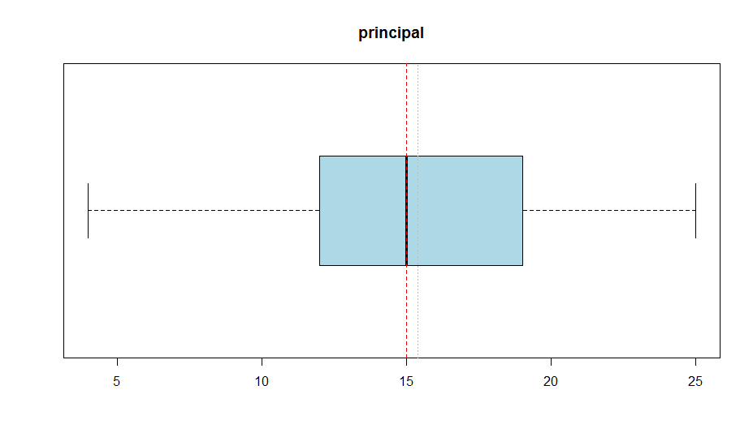
```{r fig.cap='Graficos de caja Box-Whisper',fig.width=0.7*a4ancho,fig.height=0.17*a4alto}
    par(mar=c(3,3,0,2))#mar=c(bottom, left, top, right)
    boxplot(cars$speed, col="lightblue", horizontal = TRUE, main="Boxplot 5")
    #si queremos añadir una linea al boxplot, por ejemplo para marcar el limite de 12
    abline(v=median(cars$speed), col= "red", lwd=1,lty=2) 
    abline(v=mean(cars$speed), col= "grey", lwd=1, lty=3) 
```
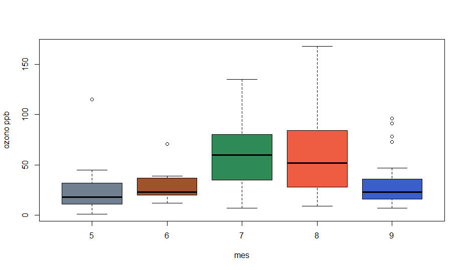
```{r}
    # Grafica de cajas boxplot 6
    airquality<-transform(airquality,Month=factor(Month))
    boxplot(Ozone ~ Month, airquality, xlab="mes", ylab="ozono ppb",
            col=c("slategray","sienna","seagreen","tomato2","royalblue3"))
```
## Ejemplo de boxplot
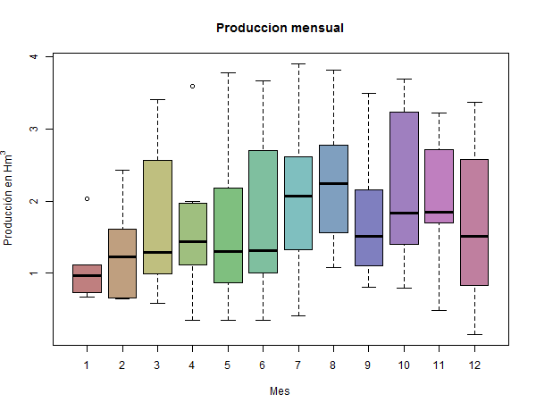
```{r }
    micolor=rainbow(12,v=0.5,alpha = 0.5)
    boxplot(produccion ~ mes,dtVal,main="Produccion mensual",
        xlab="Mes", ylab=expression('Producción en Hm'^3), col=micolor)
```

# DISPERSIÓN x-y
withdispersion
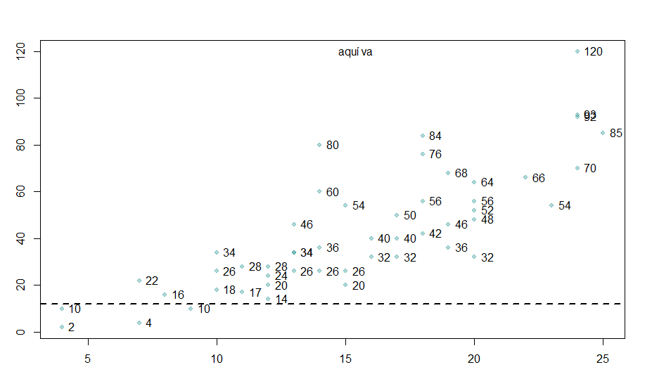
```{r ,fig.cap='Graficos de dispersion',fig.width=0.7*a4ancho,fig.height=0.23*a4alto}
    library(datasets)
    # head(cars)
    # pintamos de la datatable cars, dos variables
        par(mar=c(3,3,3,2))#mar=c(bottom, left, top, right)
        with(cars, plot(speed,dist))
    # lo mismo con conlor transparente 0.3 : cex cambia las fuentes multiplica escala
        with(cars, plot(speed,dist,col=rgb(0,.5,.5,0.3),pch=19, cex=0.8))
    # Añadimos un texto al grafico
    # lo situamos en la mitad (media), parte alta 
        text(mean(cars$speed),max(cars$dist),"aquí va")
    # añadimos etiquetas a cada punto
        with(cars, text(speed,dist, labels = dist,pos=4))#row.names(cars), pos = 4))
    # Añadir label de datos
    #text(x = speed, y = dist, labels = rownames(dataFrame), pos=4, col="red")
    #--------otra -------
    with(pollution,plot(latitude,pm25, col=region ))
        abline(h=12,lwd=2,lty=2)
```

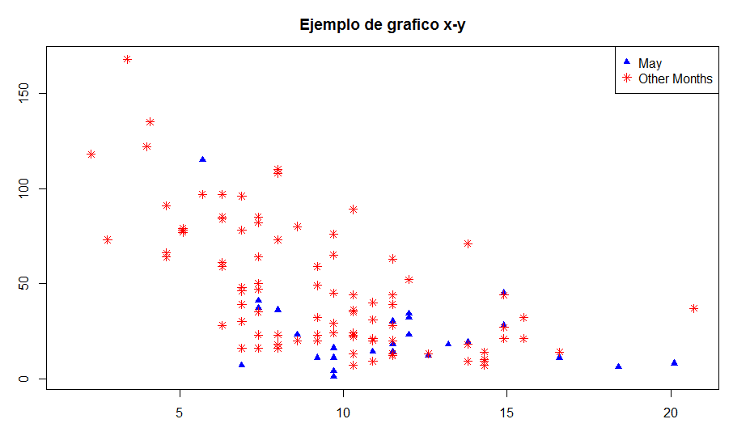
```{}
    with(airquality,plot(Wind,Ozone,type = "n"))
        may <- subset(airquality, Month==5)
    #pintamos ese conjunto
        points(may$Wind,may$Ozone,col="blue",pch=17)
    # ahora los meses que no son mayo
        notmay <- subset(airquality, Month!=5)
        points(notmay$Wind,notmay$Ozone,col="red",pch=8)
    #añadimos la legenda
        legend("topright",pch=c(17,8),col=c("blue","red"),legend=c("May","Other Months"))
    #añadimos un titulo:
        title(main="Ejemplo de grafico x-y")
        mtext("Ozone y viento en New York",outer=TRUE)
```


## X~Y CON MODELOS DE REGRESION
```{r fig.cap='Graficos de lineas con modelo de regresion',fig.width=0.7*a4ancho,fig.height=0.3*a4alto}
    with(airquality, plot(Wind,Ozone, main="Ozono y viento en NY",pch=1))
    # Añado que pinte los del mes de mayo en azul
    with(subset(airquality, Month==5), points(Wind,Ozone,col="blue",pch=3))
    # Añadimosuna leyenda
    legend("topright", pch =c(1,3), col=c("blue","black"),legend=c("Mayo","otros"))
    #añadimos linea de regresion
    model<-lm(Ozone ~ Wind,airquality)
    abline(model,lwd=2)
```


## GRÁFICOS DE LINEAS
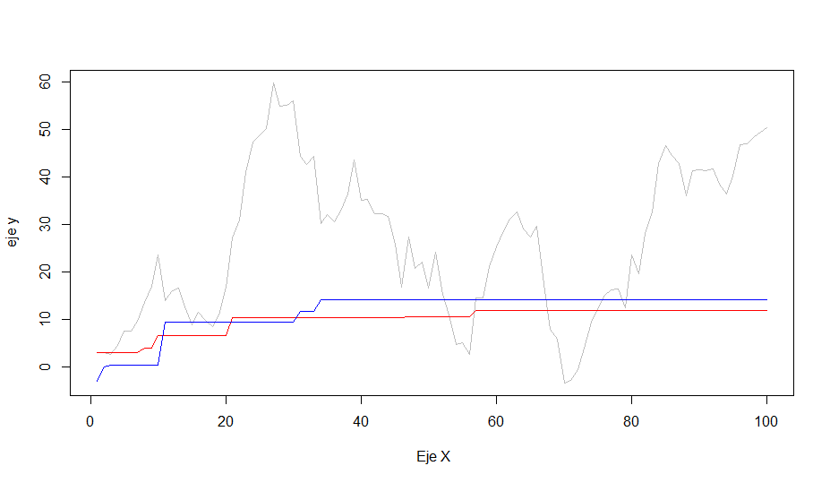
```{r,fig.cap='Graficos de lineas',fig.width=0.7*a4ancho,fig.height=0.3*a4alto}
    # Graficos de lineas
    y<-rnorm(100,0,5)
    x<-1:100
    df<-data.frame(x,y)
    par(mar=c(3,3,2,2))#mar=c(bottom, left, top, right)
    # cumsum es suma acumulada de la serie    
    plot(df$x, cumsum(df$y), ylab="eje y", xlab=" Eje X", type="n") # type n es que no lo pinta
    lines(df$x, cumsum(df$y), type= "l", col="grey")
    lines(df$x, cummax(df$y), type= "l", col="red")
    lines(df$x, -cummin(df$y), type= "l", col="blue")
    legend("topright", pch =20, col=c("grey", "red","blue"),legend=c("gris","rojo","azul"))  
```


# MULTIGRÁFICAS
```{r fig.width=0.7*a4ancho,fig.height=0.30*a4alto}
    # MULTIGRÁFICAS
    library(datasets) 
    # grafico de 3 graficas
    par(mfrow = c(1, 3),mar = c(4, 4, 2, 1), oma = c(0, 0, 2, 0))
        plot(airquality$Wind,airquality$Ozone,main="Ozone y Viento")
        plot(airquality$Solar.R,airquality$Ozone,main="Ozone y Radiacion Solar")
        plot(airquality$Temp,airquality$Ozone,main="Ozone y Temperatura")
        mtext("Ozone y tiempo en New York City",outer=TRUE)
    
```

## PANELES FACET
Con ggplot 
```{r eval=FALSE}
ggplot(datos,aes(var_x,var_y, color=var_color))+
    # facet_wrap ocupa todo y facet_grid hace una tabla x-y de paneles
    # facet_grid(VARZ~VART,margins=TRUE)
    facet_wrap(~ var_paneles ) +
    xlim(0,150) + ylim(5,15)+ # limites de ejes
    labs(title = "titulo grafico") +
    labs(subtitle = "subtitulo") +
    labs(x = "eje x", y = "eje ordenadas") +
    geom_point(size=1, alpha=0.3) +
    # leyenda del gráfico
    theme(legend.position="top", legend.text = element_text(colour="blue", size=6)) +
    # añade regresion lineal a cada conjunto de datos
    geom_smooth(size = 1, linetype = 1, method = "lm", se = FALSE)
```
```{r eval=TRUE,echo=FALSE, fig.cap='paneles wrap ggplot',fig.width=0.8*a4ancho,fig.height=0.25*a4alto}
    #install.packages
    if (!require("png")) {
       install.packages("png", dependencies = TRUE)
       library(png)
       }
    
    if (!require("grid")) {
       install.packages("grid", dependencies = TRUE)
       library(grid)
    }
    
    setwd("C:/R/proyectos/Data_Science_Coursera/04_EXPLORAR_Y_ANALIZAR_DATOS/")
    grid.raster(readPNG("imag/facets.png"))
```

# ggplot  y qplot
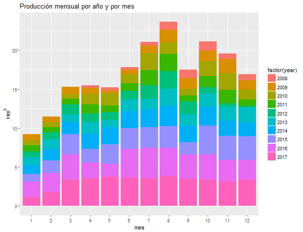
```{r }
 qplot(factor(mes),data=dtVal,fill=factor(year),
       geom="bar", weight=produccion,
       main="Producción mensual por año y por mes",
       xlab= "mes", ylab =expression('Hm'^3)
       )
```
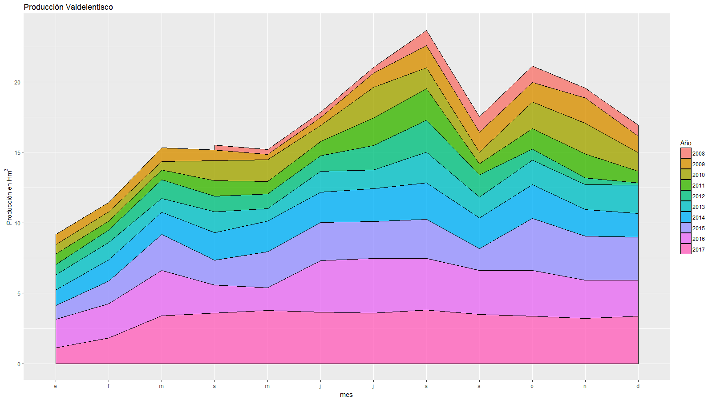
```{r }
    # creamos una nueva tabla solo con 3 columnass de datos
    aaa<-dtVal[,c("year","mes","produccion")]
    aaa$year<-factor(aaa$year)

    #aaa<-aaa[order(aaa$mes,aaa$year),]
    # Gráfica de áreas acumuladas 
    # necesitamos convertir en factor los años
  
    # pintamos la grafica
    ggplot(aaa, aes(x=mes, y=produccion,fill=year))+
        geom_area(colour="black", size=0.2, alpha=.8)+
        labs(fill='Año')+
        labs(title='Producción Valdelentisco')+
        labs(x = "mes", y = expression('Producción en Hm'^3)) +
        scale_x_discrete(name ="mes",limits=c(1:12),
                         labels=c("e","f","m","a","m","j","j","a","s","o","n","d"))

    ggsave("ggplot3.png", width = 16, height = 9, dpi = 100)
```
otro ejemplo con ggplot
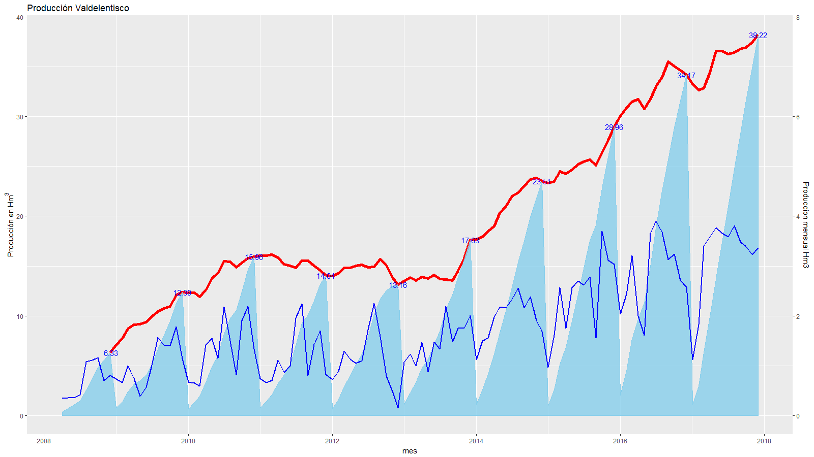
```{r}
    # pintamos la grafica
    ggplot(data = dtVal,aes(x = fecha))+
        geom_line(aes(y = tam), color = "red", lwd=2)+
        geom_area(aes(y = acumulado),colour="skyblue",fill="skyblue", size=0.2, alpha=.8) +
        geom_line(aes(y = produccion*5), color = "blue", lwd=1) +
       scale_y_continuous(sec.axis = sec_axis(~./5, name = "Produccion mensual Hm3"))+
        labs(title='Producción Valdelentisco')+
        labs(x = "mes", y = expression('Producción en Hm'^3)) +
        geom_text(aes(y = acumulado, label=ifelse(mes==12, format(acumulado, digits=2), '')),color = "blue")

  ggsave('ggplot2.png', width = 16, height = 9, dpi = 100)
```
# paletas de colores
```{r fig.width=0.7*a4ancho,fig.height=0.20*a4alto}
# generar 10 colores aleatorios de la muestra colors
    sample(colors(),10)
    par(mar = c(1, 1, 1, 1))
# FUNCION para ver las escalas en un gráfico de color
    verEscalas<-function(cv){
      myarg <- deparse(substitute(cv))
      z<- outer( 1:20,1:20, "+")
      obj<- list( x=1:20,y=1:20,z=z )
      image(obj, col=cv, main=myarg  )
    }

    # Generamos una paleta personalizada aleatoria a partir de 3 colores
    coloresorigen<-sample(colors(),3)
    paletaFer<-colorRampPalette(coloresorigen,alpha=0.3)
    # vemos la paleta
    verEscalas(paletaFer(10))
    
    # Ejemplo de uso de la paleta en un gráfico
    plot(x,y,col=paletaFer(20),pch=20,lwd=10)
    
    #cambiando tamaño de los puntos según su valor
    colorfondo<-paletaFer(20)#[3]
    with(df, 
         symbols(x=x, y=y, circles=x, inches=1/10,ann=F,
         bg=colorfondo, fg="black")) # fg="NULL"
    
    #para generar colores a partir de una de las paletas persnalizadas:
    rainbow(3) # genera 3 colores de la paleta rainbow
    terrain.colors(5) # genera 5 colores de la paleta terrain.colors
    topo.colors(4, alpha = 0.5) # # genera 5 colores de la paleta topo.colors con alfa .5
    #heat.colors
```

## Colores con ggplot2:

```{r fig.cap='Uso del color en ggplot',fig.width=0.7*a4ancho,fig.height=0.23*a4alto}
    # Uso del color en ggplot    
    library(ggplot2)
    par(mar = c(4, 4, 3, 1))
    qplot(x, y, data = df, colour=y) + 
        scale_colour_gradientn(colours=colorfondo)# cambia el color de gradiente
    
    ggplot(df, aes(y)) +
        geom_histogram(aes(fill=..count..)) +
        scale_colour_gradientn(colours = terrain.colors(8))
```

# PINTAR EN FICHERO
## PDF

```{r eval=FALSE}
    # pdf
        pdf(file = "myplot.pdf") # abrimos el dispositivo gráfico
    #creamos un grafico y lo mandamos al dispositivo pdf
        with(faithful,plot(eruptions,waiting))
        title(main="Datos de daños Geyser") # sobreescribimos el título
        dev.off()# cerramos el dispositivo, para volver a dejar la pantalla por defecto
```

## PNG

```{r eval=FALSE}
    png('plot1.png',width = 480, height = 480, units = "px")
        hist(df$y, xlab="eje X", main="titulo del grafico", col="red")
    dev.off()
```

# VARIAS ESCALAS
Para pintar un gráfico con dos escalas distintas:

```{r fig.cap='grafico con dos escalas distintas',fig.width=0.7*a4ancho,fig.height=0.3*a4alto}
    # grafico con dos escalas distintas    
    df$z<-df$y*10 # añado columna nueva a la df
    
    with(df,plot(x, cumsum(y), ylab="eje y", xlab=" Eje X", type="n"))
        # type n es que no lo pinta
        lines(x, cumsum(y), type= "l", col="blue")
        title("grafico con dos escalas")
        # añado otro grafico
        par(new = T)
        lines(df$x, y, type= "l",lwd=2, col="red", xlab=NA, ylab=NA)
        axis(side=4,xlab="eje 2", at = pretty(range(y)),col="red",col.axis = "red")
        # at puede omitirse y se calcula
```
# Gráficos dinámicos con dygraphs
la librería dygraphs permite graficos dinámicos en html muy buenos, aquí ponemos un ejemplo.
Partimos de una dataframe =dtVal, que contiene un campo llamado fecha con la fecha POSIXct, y otro con valores llamado produccion
```{r }
   # Library
    #install.packages("dygraphs")
    library(dygraphs)
    library(xts)          # To make the convertion data-frame / xts format
    library(tidyverse)
    library(lubridate)
 
    #GRafica usando dygraph
    stem=xts(x = dtVal$produccion, order.by = dtVal$fecha)
    stem1<-cbind(stem,stem+4)
    names(stem1)<-c("Valdelentisco", "Torrevieja")

    dygraph(stem1, main = "Produccion mensual histórica Total Cuenca del Segura") %>% 
        dyOptions(stackedGraph = TRUE) %>% 
        dyRangeSelector(height = 30) %>%
        dyOptions(colors = RColorBrewer::brewer.pal(3, "Set2"),fillGraph=TRUE,fillAlpha=0.1,labelsUTC = TRUE,drawGrid = TRUE)
    #dyOptions(labelsUTC = TRUE, fillGraph=TRUE, fillAlpha=0.1, drawGrid = FALSE, colors="#D8AE5A") 
    #    dyCrosshair(direction = "vertical") 

```
# Ejemplo de varis gráficas en base system
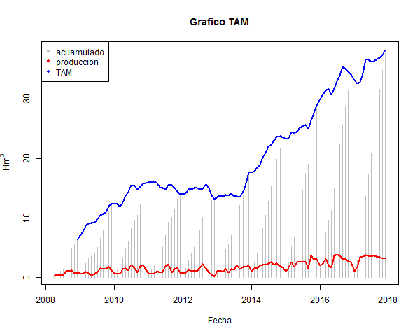
```{r}
    png('plotBS_1.png',width = 600, height = 460, units = "px")
    # grafica simple
    plot(dtVal$fecha,dtVal$acumulado, ylab=expression('Hm'^3), xlab="Fecha",type="n",
         main="Grafico TAM") 
    # añadimos las lineas restantes
    lines(dtVal$fecha,dtVal$acumulado, type= "h", col="grey")
    lines(dtVal$fecha,dtVal$produccion, type= "l", col="red",lwd=2)
    lines(dtVal$fecha,dtVal$tam, type= "l", col="blue",lwd=2)
    legend("topleft", pch =20, col=c("grey", "red","blue"),legend=c("acuamulado","produccion","TAM"))
    dev.off()
```

# Ejemplo gráficas con dos ejes en base system
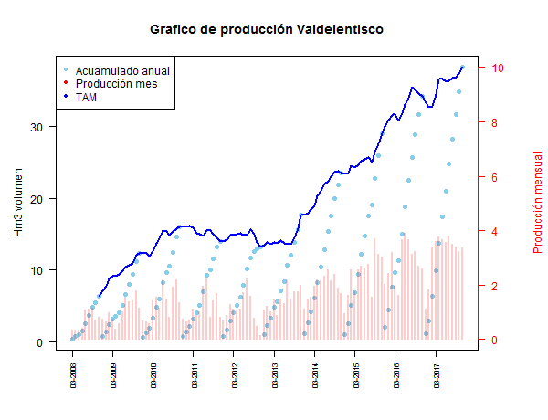
```{r}
    # Version 2
    png('plotBS_2.png',width = 600, height = 460, units = "px")
    par(mar=c(5, 4, 4, 5)+0.3)#,font.axis=11, font.lab=11, font.main=11)
    plot(dtVal$dates,dtVal$acumulado, xlab="", ylab="",axes=FALSE,type="n",
         col="black",main="Grafico de producción Valdelentisco") 
         
    axis(2, ylim=c(0,50),col="black",las=1)  ## las=1 hace las marcas horizontales del eje
    #axis.Date(1, at=seq(min(dtVal$dates), max(dtVal$dates), by="12 mon"), format="%m-%Y")
    # definimos el eje de fechas debe ser DATE no positxt
    axis.Date(1, at=seq(min(dtVal$dates), max(dtVal$dates), by="1 year"),
              format="%m-%Y",las=2,cex.axis = .7)

    mtext("Hm3 volumen",side=2,line=2.5)
    box()
    # añadimos las lineas restantes
    lines(dtVal$dates,dtVal$acumulado, type= "p", col="skyblue",pch=16)
    lines(dtVal$dates,dtVal$tam, type= "l", col="blue", lwd=2)
    legend("topleft", pch =20, col=c("skyblue", "red","blue"),legend=c("Acuamulado anual","Producción mes","TAM"))#,text.font=3)
    # segundo eje
    par(new=TRUE)
    plot(dtVal$dates,dtVal$produccion, xlab="", ylab="", ylim=c(0,10),
         axes=FALSE,type="h",col=rgb(1, 0, 0, .2), lwd=2) 
    #lines(dtVal$fecha,dtVal$produccion, type= "l", col="red",lwd=2)
    ## HAcemos el eje en la izquierda(line=4)
    mtext("Producción mensual",side=4,col="red",line=4) 
    axis(4, ylim=c(0,10), col="red",col.axis="red",las=1)
    dev.off()
```
# Ejemplo de varis gráficas en base system

```{r}
    png('plotBS_1.png',width = 600, height = 460, units = "px")
    # grafica simple
    plot(dtVal$fecha,dtVal$acumulado, ylab=expression('Hm'^3), xlab="Fecha",type="n",
         main="Grafico TAM") 
    # añadimos las lineas restantes
    lines(dtVal$fecha,dtVal$acumulado, type= "h", col="grey")
    lines(dtVal$fecha,dtVal$produccion, type= "l", col="red",lwd=2)
    lines(dtVal$fecha,dtVal$tam, type= "l", col="blue",lwd=2)
    legend("topleft", pch =20, col=c("grey", "red","blue"),legend=c("acuamulado","produccion","TAM"))
    dev.off()
```
# ggvis
ggvis es una libreria fantastica para representaciones graficas, mas moderna que ggplot y más adaptable:
    
```{r}
library(ggvis)
    # Add a layer of points to the graph below.
pressure %>%
  ggvis(~temperature, ~pressure, stroke := "skyblue") %>%
  layer_lines()%>%
  layer_points()
# Rewrite the code below so that only the points layer uses the shape property.
pressure %>%
  ggvis(~temperature, ~pressure) %>%
  layer_lines(stroke := "skyblue") %>%
  layer_points( shape := "triangle-up")

# Refactor the code for the graph below to make it as concise as possible
pressure %>%
  ggvis(~temperature, ~pressure,strokeOpacity := 0.5,stroke := "skyblue",strokeWidth := 5) %>%
  layer_lines() %>%
  layer_points(fill = ~temperature,
              shape := "triangle-up",
              size := 300)
# Copy and adapt the solution to the first instruction below so that only the lines layer uses a skyblue stroke.
pressure %>%
  ggvis(~temperature,~pressure) %>%
  layer_lines(stroke := "skyblue")%>%
  layer_points()
  
mtcars %>% ggvis(~mpg, ~wt)
mtcars %>% ggvis(~mpg, ~wt, fill = ~cyl)
mtcars %>% ggvis(~mpg, ~wt, fill := "red")
mtcars %>% ggvis(~mpg)
```

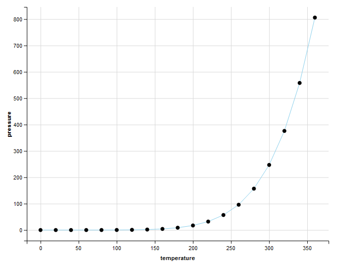

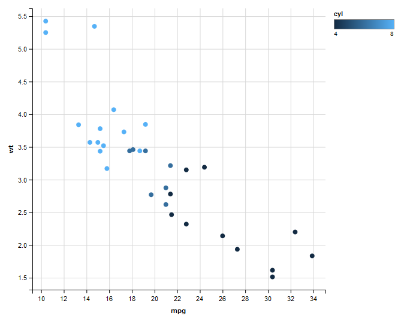
## layer_model_predictions

```{r}
# Add more layers to the line plot
pressure %>%
  ggvis(pressure ~ temperature) %>%
  layer_lines(opacity := 0.5) %>%
  layer_points() %>%
  layer_model_predictions(model = "lm", stroke :="navy") %>%
  layer_smooths(stroke :="skyblue")

pressure %>%  
  ggvis(temperature ~ pressure, stroke := "darkred") %>%
  layer_lines(stroke := "orange", strokeDash := 5, strokeWidth := 5) %>%
  layer_points(size := 100, fill := "lightgreen",shape := "circle") %>%
  layer_smooths()
```
  
## Ejes y leyendas en ggvis
```{r}
# ggvis4
faithful %>% 
  ggvis(~waiting, ~eruptions) %>% 
  layer_points() %>% 
  add_axis("x", 
         title = "Time since previous eruption (m)", 
         values = c(seq(50,90,by=10)), 
         subdivide = 9,
         orient = "top") %>% 
  add_axis("y", 
         title = "Duration of eruption (m)", 
         values = c(seq(2,5,by=1)), 
         subdivide = 9,
         orient = "right")
         
# ggvis 3
faithful %>% 
  ggvis(~waiting, ~eruptions, opacity := 0.6, 
        fill = ~factor(round(eruptions))) %>% 
  layer_points() %>%
  add_legend("fill", title = "~ duration (m)",orient="left")      
```
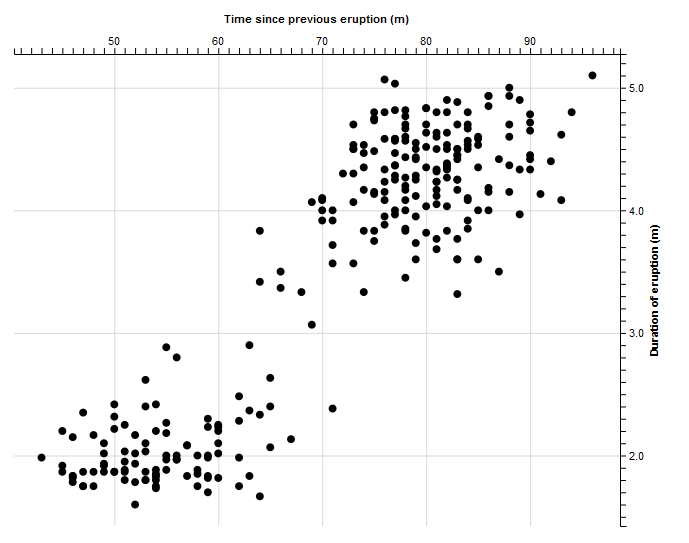

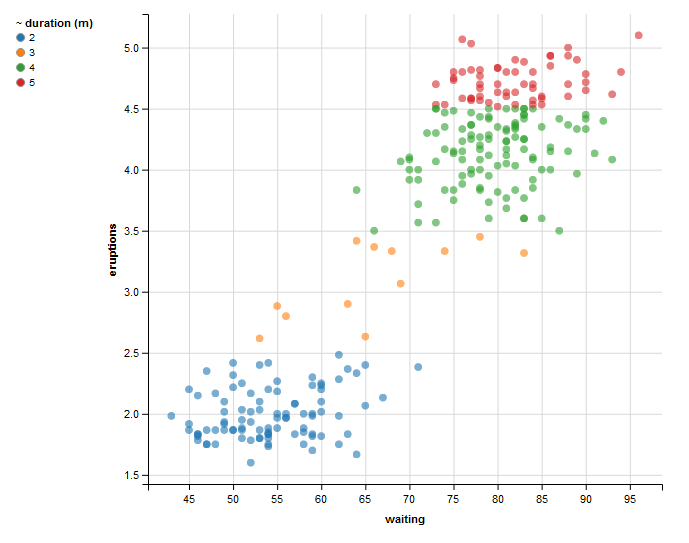
